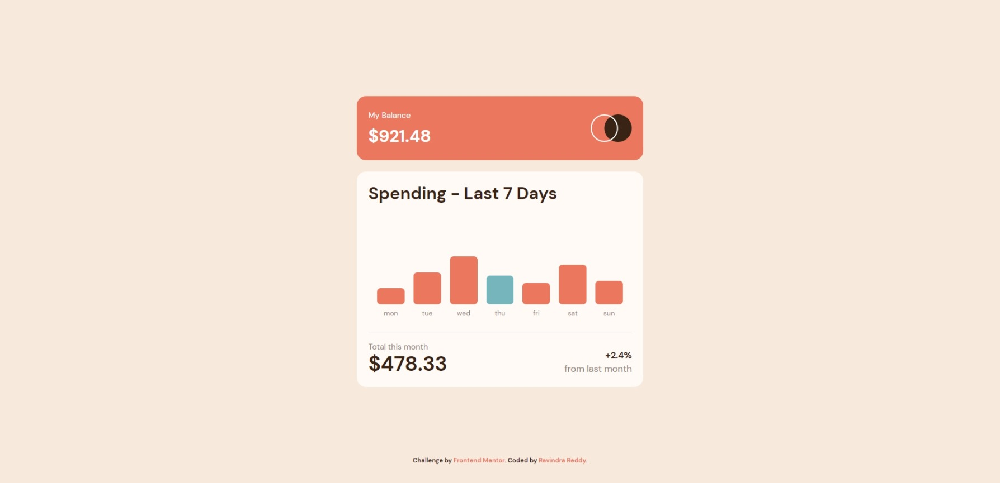
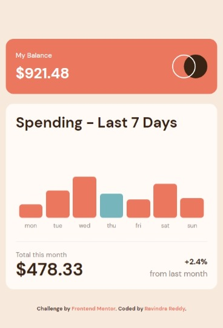
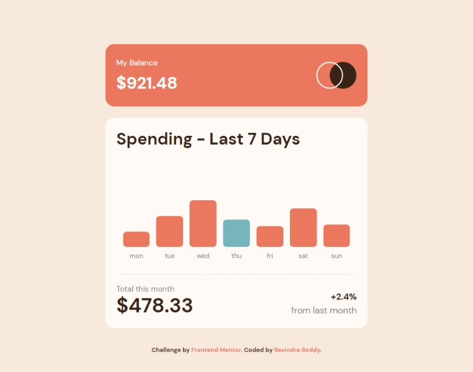
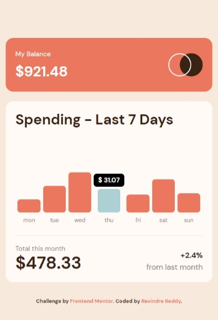

# Frontend Mentor - Expenses chart component solution

This is a solution to the [Expenses chart component challenge on Frontend Mentor](https://www.frontendmentor.io/challenges/expenses-chart-component-e7yJBUdjwt). Frontend Mentor challenges help you improve your coding skills by building realistic projects. 



## Table of contents

- [Overview](#overview)
  - [The challenge](#the-challenge)
  - [Screenshot](#screenshot)
  - [Links](#links)
- [My process](#my-process)
  - [Built with](#built-with)
  - [What I learned](#what-i-learned)
  - [Useful resources](#useful-resources)
- [Author](#author)

**Note: Delete this note and update the table of contents based on what sections you keep.**

## Overview

### The challenge

Users should be able to:

- View the bar chart and hover over the individual bars to see the correct amounts for each day
- See the current day’s bar highlighted in a different colour to the other bars
- View the optimal layout for the content depending on their device’s screen size
- See hover states for all interactive elements on the page
- **Bonus**: Use the JSON data file provided to dynamically size the bars on the chart

### Screenshot
<!-- 
- **#1 - Desktop View**


- **#2 - Mobile View**



- **#3 - Tablet View**



- **#4 - Active States View**

 -->


### Links

- Solution URL: [GitHub Repo](https://github.com/ravindra135/FrontendMentor-expenses-chart-component-main)
- Live Site URL: [Watch LIVE](https://ravindra135.github.io/FrontendMentor-expenses-chart-component-main/)

## My process

### Built with

- HTML5
- TailWind CSS (CSS FRAMEWORK)
- JavaScript
- Flexbox

### What I learned

- CSS Mobile-First

- **Why I have used *tailwind* for this project ?** - As I learned Tailwind a month ago, as a part of the practice I have used Tailwind Framework.

- I have improved myself in understanding javascript more efficiently.

- **How to get the Data of from *.json* file to Javascript Obj.?** -  This is the first time, I worked for JSON data Parsing. So, after digging on Internet I have found some useful stuff, which solved my problems.

```js
// Here I have Used AJAX for JSON Data.

let localData; 
// a Variable where the Array Data, from JSON is stored in;

$.ajax({
    type: "GET",
    url: "./data.json", // Json FIle
    success:function(response) {
       localData = response; // Storing the Json Data;
       jsonExport(); // Function ToDo after fetching Data;
    }
});
/*
Note After Defining the localData = response; we cannot use localdata at Global Level; So, we used a function; from which we can access the JSON Data via localData object.
*/
```

### Useful resources

- JS JSON  - [Learn Here](https://www.w3schools.com/js/js_json_intro.asp)

## Author

- Frontend Mentor - [@ravindra135](https://www.frontendmentor.io/profile/ravindra135)
- Github - [@ravindra135](https://github.com/ravindra135/)
- Instagram - [@ravindra_since2k](https://www.instagram.com/ravindra_since2k/)

🚀 ***Happy Coding*** 🚀